<!-- 
%\VignetteEngine{knitr}
%\VignetteIndexEntry{Popgraphs}
-->

<link href="http://dyerlab.bio.vcu.edu/media/dyerlab.doc.css" rel="stylesheet"></link>

Population Graphs in R
========================================================

<!--  Some preamble stuff for knitr  -->


Introduction
-----------

The **popgraph** package is designed to take multivariate data and construct a Population Graph (Dyer & Nason 2004).  This is a graph-theoretic interpretation of genetic covariance and serves as a tool for understanding underlying evolutionary history for a set of populations.  

These routines were originally in the **gstudio** package but were excised out for simplicity. This analysis is *not* limited solely to genetic data and can be used generally for many types of analyses.  As such, I pulled this out of the genetic package and allow it to remain on its own.  To get your data using **gstudio** with genotypes and such into a format for this package, translate the genotypes into their multivariate format as:


```r
data <- as.matrix(my_genetic_data)
```


For more information on this, see the documentation on the **gstudio** package (a copy is mirrored at http://dyerlab.bio.vcu.edu/ and a clone of the package can be checked out at https://github.com/dyerlab/gstudio)


Creating Population Graphs
--------------------------

There are two ways to create a population graph:

1. In this package using the function *population_graph()* and,
+  Via the servers at http://dyerlab.bio.vcu.edu (which use this packages to do the translation) or via GeneticStudio (an older software package)


```r
require(popgraph)
```


### Creating *De Novo* Graphs

Here we will focus on the former approach as it is native to this package.  If you use the latter one, it will produce a *.pgraph file and you can read it in using 


```r
A <- matrix(0, nrow = 5, ncol = 5)
A[1, 2] <- A[2, 3] <- A[1, 3] <- A[3, 4] <- A[4, 5] <- 1
A <- A + t(A)
A
```

```
##      [,1] [,2] [,3] [,4] [,5]
## [1,]    0    1    1    0    0
## [2,]    1    0    1    0    0
## [3,]    1    1    0    1    0
## [4,]    0    0    1    0    1
## [5,]    0    0    0    1    0
```


There is a quick function, `as.population_graph()` that takes either an existing **igraph**object or a matrix and turns them into *population_graph* objects.


```r
g <- as.population_graph(A)
```


There are several options available under the `mode` parameter.  We typically use the undirected graph option but the following are also available:

1. `undirected` The connections between nodes are symmetric.  This is the default for population graphs as covariance, the quantity the edge is representing is symmetrical.
+ `directed` The edges are asymetric.
+ `max` or `min` Will take the largest (or smallest) value of the matrix (e.g., $max(A[i,j], A[j,i])$ or $min( A[i,j], A[j,i])$ ).
+ `upper` or `lower` Uses either the upper or lower element of the matrix.
+ `plus` Adds upper and lower values (e.g., $A[i,j] + A[j,i]$).

There are many other ways to create **igraph**objects *de novo* but this is the easiest method.


#### Node &amp; Edge Attributes

The underlying structure of an **igraph**object allows you to assoicate attributes (e.g., other data) with nodes and edges. Node attributes are accessed using the $V(graph)$ operator (for vertex) and edge attributes are done via $E(graph)$.  Attributes can be set as well as retrieved using the same mechanisms.


```r
V(g)$name <- c("Olympia", "Bellingham", "St. Louis", "Ames", "Richmond")
V(g)$group <- c("West", "West", "Central", "Central", "East")
V(g)$color <- "#cca160"
list.vertex.attributes(g)
```

```
## [1] "name"  "group" "color"
```

```r
V(g)$name
```

```
## [1] "Olympia"    "Bellingham" "St. Louis"  "Ames"       "Richmond"
```


```r
E(g)
```

```
## Edge sequence:
##                             
## [1] Bellingham -- Olympia   
## [2] St. Louis  -- Olympia   
## [3] St. Louis  -- Bellingham
## [4] Ames       -- St. Louis 
## [5] Richmond   -- Ames
```

```r
E(g)$color <- c("red", "red", "red", "blue", "dark green")
list.edge.attributes(g)
```

```
## [1] "weight" "color"
```


### Adding data to a graph

A population graph is made more informative if you can associate some data with topology.  External data may be spatial or ecolgoical data associated with each node.  Edge data may be a bit more complicated as it is traversing both spatial and ecolgoical gradients and below we'll see how to extract particular from rasters using edge crossings. 

Included in the **popgraph** package are some build-in data sets.  You can load these into R using the `data()` function as:


```r
data(lopho)
class(lopho)
```

```
## [1] "igraph"           "population_graph"
```

```r
lopho
```

```
## IGRAPH UNW- 21 52 -- 
## + attr: name (v/c), size (v/n), color (v/c), Region (v/c), weight
##   (e/n)
```


The function `decorate_graph()` allows you to add more information to the graph object by combining data from an external source, in this case a `data.frame` object.  Here is an example with some built-in data.  The option `meta.stratum` indicates the name of the column that has the node labels in it (which are stored as `V(graph)$name`).


```r
data(baja)
summary(baja)
```

```
##     Region     Population    Latitude      Longitude   
##  Baja  :16   BaC    : 1   Min.   :22.9   Min.   :-115  
##  Sonora:13   Cabo   : 1   1st Qu.:24.4   1st Qu.:-113  
##              CP     : 1   Median :27.9   Median :-112  
##              Ctv    : 1   Mean   :27.3   Mean   :-112  
##              ELR    : 1   3rd Qu.:29.6   3rd Qu.:-111  
##              IC     : 1   Max.   :31.9   Max.   :-109  
##              (Other):23
```

```r
lopho <- decorate_graph(lopho, baja, meta.stratum = "Population")
lopho
```

```
## IGRAPH UNW- 21 52 -- 
## + attr: name (v/c), size (v/n), color (v/c), Region (v/c),
##   Latitude (v/n), Longitude (v/n), weight (e/n)
```


Each vertex has seveal different types of data associated with it now.  We will use this below.


### Plotting a graph using normal plotting methods

One of the main benefits to using R is that you can leverage the mutlitude of other packages to visualize and manipulate your data in interesting and informative ways.  Since a `population_graph` is an instance of an **igraph**element, we can use the **igraph**routines for plotting.  Here is an example.


```r
plot(g)
```

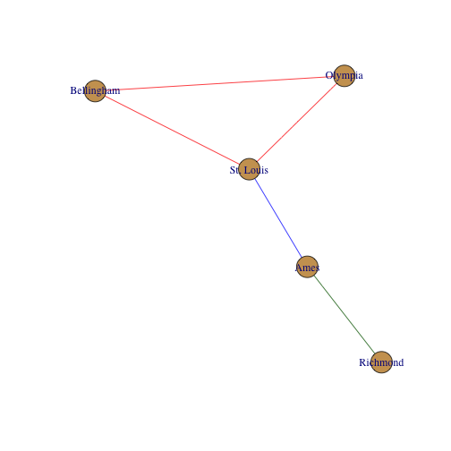


There are several different options you can use to manipulate the graphical forms.  By default, the plotting routines look for node and edge attributes such as `name` and `color` to plot the output appropriately.  There are several additional plotting functions for plotting **igraph** objects.  Here are some examples.


```r
plot(g, edge.color = "black", vertex.label.color = "darkred", vertex.color = "#cccccc", 
    vertex.label.dist = 1)
```

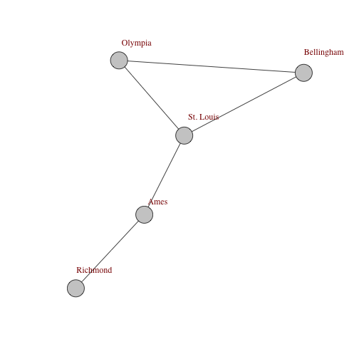


```r
layout <- layout.circle(g)
plot(g, layout = layout)
```

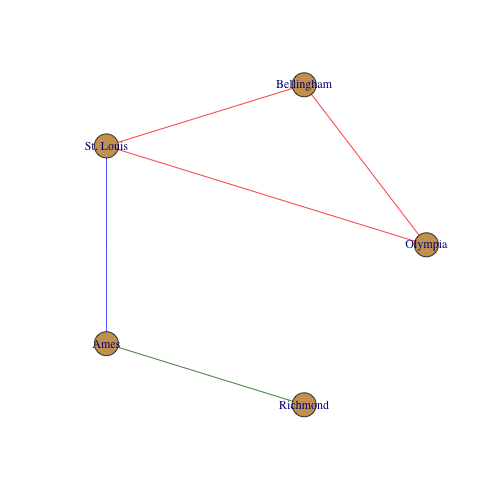

```r
layout <- layout.fruchterman.reingold(g)
plot(g, layout = layout)
```


### Plotting a graph using **ggplot2** routines

The **ggplot2** package provides a spectacular plotting environment in an intuitive context and there are now some functions to support the Population Graphs in this context.  

If you haven't used **ggplot2** before, it may at first be a bit odd because it deviates from normal plotting  approaches where you just shove a bunch of arguments into a single plotting function.  In **ggplot**, you build a graphic in the same way you build a regression equation.  A regression equation has an intercept and potentially a bunch of independent terms.  This is exactly how **ggplot** builds plots, by adding togther components.

To specifiy how things look in a plot, you need to specify an aesthetic using the `aes()` funciton.  Here is where you supply the variable names you use for coordinate, coloring, shape, etc.  For both of the `geom_popgraph_` funcitons, these names **must** be attributes of either the node or edge sets in the graph itself.

Here is an example using the *Lopohcereus* graph.  We begin by making a `ggplot()` object and then adding to it a `geom_` object.  The **popgraph** package comes with two funcitons, one for edges and one for nodes.  


```r
require(ggplot2)
p <- ggplot()
p <- p + geom_popgraph_edgeset(aes(x = Longitude, y = Latitude), lopho)
p
```

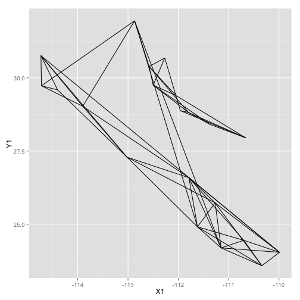


I broke up the plotting into several lines to improve readability, it is not necessary to to this in practice though.  The addition of additional `geom_` objects to the plot will layer them on top (n.b., I also passed the *size=4* option to the plot as the default point size is a bit too small and this is how you could change that).


```r
p <- p + geom_popgraph_nodeset(aes(x = Longitude, y = Latitude), lopho, size = 4)
p
```


And then you can add additional options to the plot, like axis labels and a less exciting background theme (the `theme_empty()` provided by **popgraph** is actually transparent so you can save the image and throw it into a presentation as necessary).


```r
p <- ggplot() + geom_popgraph_edgeset(aes(x = Longitude, y = Latitude), lopho, 
    color = "darkgrey")
p <- p + geom_popgraph_nodeset(aes(x = Longitude, y = Latitude, color = Region, 
    size = size), lopho)
p <- p + xlab("Longitude") + ylab("Latitude")
p + theme_empty()
```

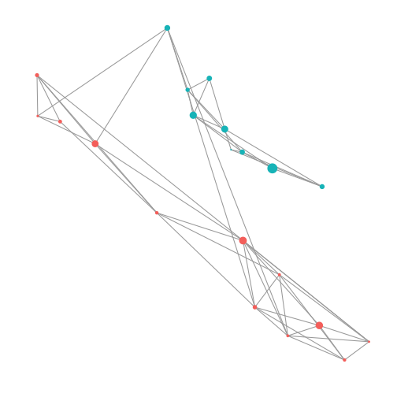


### Reading Existing **popgraph** Files


The online versions of Population Graphs provides a *.pgraph file for visualization. These files are visualized in several different software platforms including GeneticStudio (Dyer 2009), a OpenGL visualization application (Dyer &amp; Nason 2004), an online visualization framework at http://dyerlab.bio.vcu.edu, and of course, in R.  We shall focus on this last one.  Reading in files to R 


```r
graph <- read.population_graph("thegraph.pgraph")
```


### Saving Population Graph Objects


A **popgraph** object is a normal R object and can be saved using the normal R mechanisms.


```r
save(lopho, file = "MyLophoGraph.rda")
```


For interoperability, **popgraph** objects can also be saved in other formats. These are accessed through the `write.population_graph()` function.  


```r
write.population_graph(lopho, file = "~/Desktop/Cactus.pgraph", format = "pgraph")
```

There are several other options available for outputing your graph.  Currently the other formats that have been implemented are:

1. `json` A format for html javascript data processing.  
+ `kml` The Keyhole Markup Language which is read by GoogleEarth.  This requires `Latitude` and `Longtitude` vertex properties.
+ `graphml` The graph markup language.
+ `html` Export as an interactive html document you can manipulate on your desktop (uses javascript d3.js library so you need an internet connection).
+ `pajek` Export to a format that works with the software Pajek (http://pajek.imfm.si/doku.php?id=pajek)
+ `pgraph` The format used in GeneticStudio and the original popgraph 3D viewer (this is the default).
+ `adjacency` Saves the adjacency matrix of the graph (binary) as a CSV file
+ `paths` Saves the shortest paths matrix as a CSV file
+ `weights` Saves the adjacency matrix with edge weights.


Spatial Population Graphs
-------------------------

Mapping the nodes and edges onto real space is a key task in the understanding of how covariance is partitioned on the landscape.  There are several approaches that can be used in R since it is such a flexible platform.  In what follows I will use a series of techniques that I find useful ordered from the simplest to the more complicated.  

### General Maps

For quick maps I typically use the **maps** library. It is pretty straightforward to use and does not take too much thought to quickly plot something or find the approporiate raster files.  Below, I add some coordinates to the data set.


```r
V(g)$Latitude <- c(47.15, 48.75, 38.81, 42.26, 37.74)
V(g)$Longitude <- c(-122.89, -122.49, -89.98, -93.47, -77.16)
```


Then overlay this onto a map using the `overlay_population_graph()` function.    Here is an example where I plot it over the map of the US states.


```r
require(maps)
map("state")
overlay_population_graph(g)
```

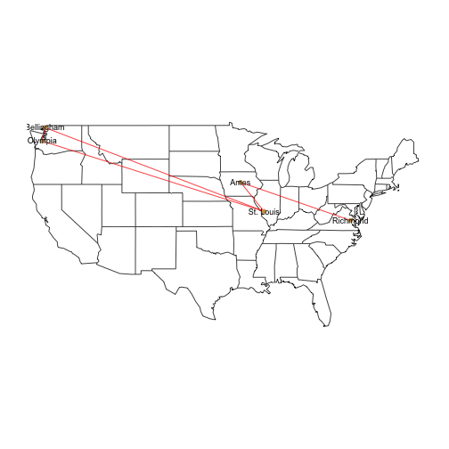


This function **requires** that you already have a plot available (it uses the `lines()` and `points()` routines).  If you try to just overlay this with no existing plot, it will not work (and should throw an error).


### Using Google and **ggplot2**

R has some pretty good facilities for using spatial assests from Google and OpenStreetMaps and is a very easy way to get quick plots from Population Graphs, particularly if you can integrate it into the **ggplot2** framework.

Using the **ggmap** package, you can request map tiles and use as backgrounds onto which you can plot specific objects.  To do so, you must first get:

- Either the centroid of the location you are interested in finding and a value of zoom (just like in google maps), or
- A bounding box with left, bottom, right, top coordinates.  This is a bit of an experimental thing and does not always get you what you want.  

Some fiddling is required with either way you go.  The map you get from `get_map()` is essentially a huge matrix of hex colors as shown above.


```r
require(ggmap)
location <- c(mean(V(lopho)$Longitude), mean(V(lopho)$Latitude))
location
```

```
## [1] -112.18   27.91
```

```r
map <- get_map(location, maptype = "satellite", zoom = 6)
dim(map)
```

```
## [1] 1280 1280
```

```r
map[1:4, 1:4]
```

```
##      [,1]      [,2]      [,3]      [,4]     
## [1,] "#3C5285" "#3C5285" "#35497B" "#364B81"
## [2,] "#3C5285" "#3C5285" "#3C5285" "#3C5285"
## [3,] "#3B4D85" "#3C5285" "#41568C" "#41568C"
## [4,] "#3C5285" "#3C5285" "#41568C" "#41568C"
```


This map object can be passed on to `ggmap()`, which replaces the traditional `ggplot()` funciton and sets up the bounding box in terms of Latitude and Longtidue.  Onto this, you can plot the graph topologoy using:

- `geom_popgraph_edgeset()` This takes the graph and plots out the edges.  
- `geom_popgraph_nodeset()` This plots out the nodes.  You could probably use a regular *data.frame* and `geom_point()` as well. Here is an example:


```r
p <- ggmap(map)
p <- p + geom_popgraph_edgeset(aes(x = Longitude, y = Latitude), lopho, color = "white")
p <- p + geom_popgraph_nodeset(aes(x = Longitude, y = Latitude, color = Region, 
    size = size), lopho)
p + xlab("Longitude") + ylab("Latitude")
```

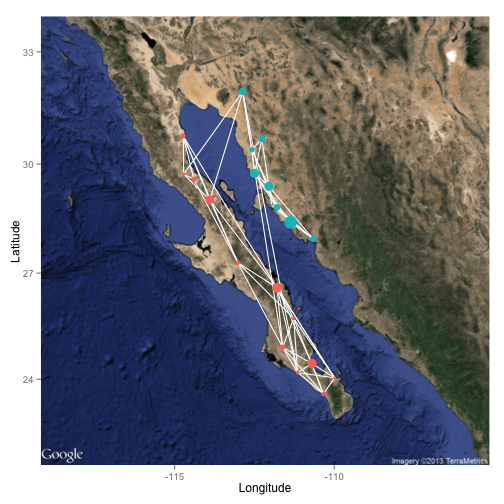


### Integrating Raster Maps

At times we have raster data upon we can plot a population graph. Here is an example from Baja California. The underlying raster image is croped from a WorldClim tile and represents elevation.  


```r
data(alt)
plot(alt)
```

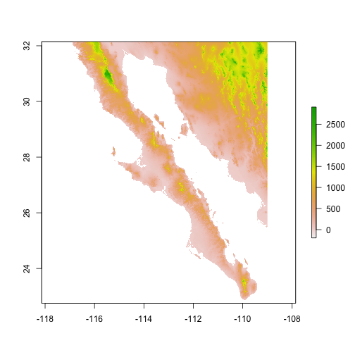


Since it is a **raster** object, it knows how to plot itself relatively well.  There are a ton of good references for showing you how to play with raster data (e.g., Bivand *et al.* 2008)

To plot our graph onto this topology, we export the spatial components of the graph into objects that interact with rasters.  The packages provides simple extraction of features into `SpatialLines` and `SpatialPoints` objects.


```r
lopho.nodes <- to_SpatialPoints(lopho)
lopho.nodes
```

```
## SpatialPoints:
##             x     y
## BaC    -111.8 26.59
## Ctv    -114.7 29.73
## LaV    -110.0 24.04
## Lig    -111.3 25.73
## PtC    -111.2 24.19
## PtP    -113.9 29.03
## SLG    -114.4 29.59
## SnE    -110.7 24.45
## SnF    -114.7 30.76
## SnI    -113.0 27.29
## StR    -111.6 24.91
## TsS    -110.3 23.58
## CP     -110.7 27.95
## LF     -112.3 30.68
## PL     -112.6 30.39
## SenBas -112.9 31.95
## Seri   -112.0 28.88
## SG     -112.0 29.40
## SI     -112.5 29.75
## SN     -111.8 28.82
## TS     -111.4 28.41
## Coordinate Reference System (CRS) arguments: NA
```

```r
lopho.edges <- to_SpatialLines(lopho)
lopho.edges
```

```
## class       : SpatialLines 
## nfeatures   : 52 
## extent      : -114.7, -110, 23.58, 31.95  (xmin, xmax, ymin, ymax)
## coord. ref. : NA
```


Once we have them extracted into the right format, we can add them to the raster plot.  I plot the nodes twice to overlay a circular icon (`pch=16`) onto the default cross marker and make them 50\% larger (`cex=1.5`).


```r
plot(alt)
plot(lopho.edges, add = TRUE, col = "#555555")
plot(lopho.nodes, add = TRUE, col = "black", cex = 1.5)
plot(lopho.nodes, add = TRUE, col = V(lopho)$color, pch = 16, cex = 1.5)
```

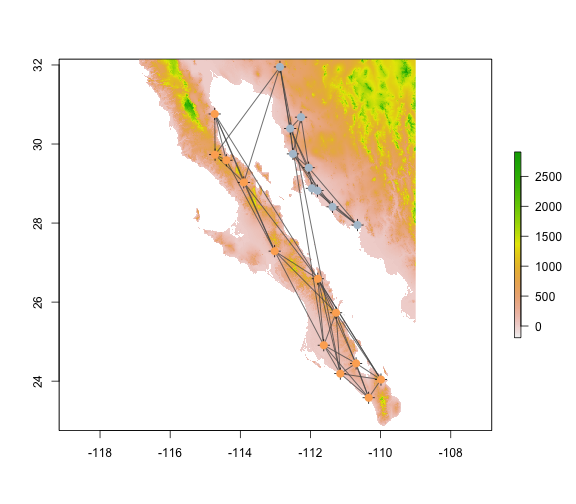


Extracting Spatial Data Using Population Graphs
-----------------------------------------------

Since we are dealing with the spatial stuff right now, it makes sense to look into how we can use the topological features of the graph to extract spatial data.  


### Node Specific Data

The node data `nodes` is a `SpatialPoints` object and can be used to pull data from raster sources.  I'll start by creating a `data.frame` with some existing data in it.


```r
df.nodes <- data.frame(Pop = V(lopho)$name, Latitude = V(lopho)$Latitude, Longitude = V(lopho)$Longitude)
```


Then we can extract the elevation from the `alt` raster as:


```r
df.nodes$Elevation <- extract(alt, lopho.nodes)
summary(df.nodes)
```

```
##      Pop               Latitude      Longitude      Elevation  
##  Length:21          Min.   :23.6   Min.   :-115   Min.   :  5  
##  Class :character   1st Qu.:25.7   1st Qu.:-113   1st Qu.: 14  
##  Mode  :character   Median :28.8   Median :-112   Median : 66  
##                     Mean   :27.9   Mean   :-112   Mean   :159  
##                     3rd Qu.:29.7   3rd Qu.:-111   3rd Qu.:259  
##                     Max.   :31.9   Max.   :-110   Max.   :667
```


Additional data could be extracted from other rasters.  See http://worldclim.org for some example data that may prove useful.


### Data Along Edges


```r
df.edge <- data.frame(Weight = E(lopho)$weight)
summary(df.edge)
```

```
##      Weight     
##  Min.   : 1.38  
##  1st Qu.: 3.77  
##  Median : 6.55  
##  Mean   : 6.93  
##  3rd Qu.: 9.38  
##  Max.   :14.22
```


For each of the `{r}length(E(lopho))` edges, we can exract the elevation profile.  Here is an example from one of the edges.


```r
plot(alt)
plot(lopho.edges[3], add = TRUE, col = "red", lwd = 3)
```


Along this transect, you can pull out the elevation values as follows (n.b., the return object is a list so I'm only taking the first, and only, element in it).


```r
require(ggplot2)
Elevation <- extract(alt, lopho.edges[3])[[1]]
e <- extent(lopho.edges[3])
e
```

```
## class       : Extent 
## xmin        : -111.8 
## xmax        : -111.2 
## ymin        : 24.19 
## ymax        : 26.59
```

```r
Latitude <- seq(ymin(e), ymax(e), length.out = length(Elevation))
qplot(Latitude, Elevation, geom = "line")
```

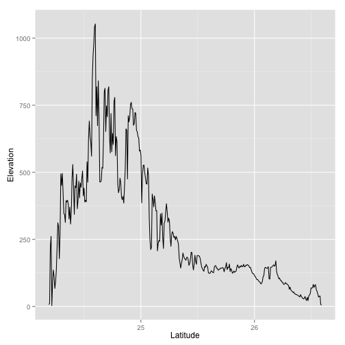


There is a lot of ways that you can play with this functionality.  This should get you going.


Extracting Graph-Theoretic Parameters
-------------------------------------

The underlying structure of a **popgraph** object is based upon the **igraph** package from Gabor Csardi.  A population graph is essentially a specific kind of **igraph**object and can be decorated with metadata that is useful for spatial population genetic analyses.  As such, there is a wealth of existing analyses from both the **igraph** as well as the **sna** packages that can be used on **popgraph** objects.  Here are some examples.

### Matrix Representations of Population Graph Objects

A graph topology is a graphical representation of a matrix and there are several reasons why you may want to use these matrices.  The function `to_matrix()` is an easy front-end to several kinds of matrices.  Matrix structure itself can be defined by adjacency matrics, either binary (the default) or weighed by the edge weight.  Several graph-theoretic parameters are derived from the adjacency matrix.  Here is an example from our little graph that started this document.


```r
to_matrix(g, mode = "adjacency")
```

```
##            Olympia Bellingham St. Louis Ames Richmond
## Olympia          0          1         1    0        0
## Bellingham       1          0         1    0        0
## St. Louis        1          1         0    1        0
## Ames             0          0         1    0        1
## Richmond         0          0         0    1        0
```

```r
to_matrix(g, mode = "edge weight")
```

```
##            Olympia Bellingham St. Louis Ames Richmond
## Olympia          0          1         1    0        0
## Bellingham       1          0         1    0        0
## St. Louis        1          1         0    1        0
## Ames             0          0         1    0        1
## Richmond         0          0         0    1        0
```


In addition to who each node is connected to, it is often of interest to know the length of the shortest path through the matrix connecting nodes.  Here is a slightly larger example, using the cactus data so we can look at isolation by graph distance.


```r
cGD <- to_matrix(lopho, mode = "shortest path")
cGD[1:5, 1:5]
```

```
##        BaC    Ctv    LaV    Lig   PtC
## BaC  0.000  9.195  9.053  9.716 12.38
## Ctv  9.195  0.000 13.083 15.233 20.49
## LaV  9.053 13.083  0.000 12.073 12.80
## Lig  9.716 15.233 12.073  0.000 14.22
## PtC 12.382 20.491 12.800 14.225  0.00
```


It should be noted that the shortest distance through a population graph is defined as the parameter $cGD$, conditional graph distance (see Dyer *et al.* 2010 for more information on this parameter).

Now, we need the physical distance between the nodes.  If the physical size of the sampling area is small we could just use the Pythagorean equation.  However, here the distance is relatively large and the curvature of the earth may be of interest to take into account.  There are seveal functions that will calculate 'great circle distance' but the easiest is `rdist.earth()` from the **fields** funtion.  


```r
require(fields)
pDist <- rdist.earth(cbind(V(lopho)$Longitude, V(lopho)$Latitude))
```


Now, we can plot these values against each other to see if there is a pattern of 'isolation by distance' captured in the graph topology.  To do this, I extract only the upper triangle (e.g., the values above the diagonal of each matrix) because they are symmetric matrices and we do not want to look at each datum twice.


```r
df <- data.frame(cGD = cGD[upper.tri(cGD)], Phys = pDist[upper.tri(pDist)])
cor.test(df$Phys, df$cGD, method = "spearman")
```

```
## 
## 	Spearman's rank correlation rho
## 
## data:  df$Phys and df$cGD
## S = 729992, p-value < 2.2e-16
## alternative hypothesis: true rho is not equal to 0
## sample estimates:
##   rho 
## 0.527
```


We can plot these values and make a trendline pretty easily.  Here is a plot using **ggplot2** (a very nice plotting library; you could use `plot()` to do the normal plotting but I think **ggplot2** does such a nice job I encourage its use).  


```r
qplot(Phys, cGD, geom = "point", data = df) + stat_smooth(method = "loess") + 
    xlab("Physical Distance") + ylab("Conditional Genetic Distance")
```

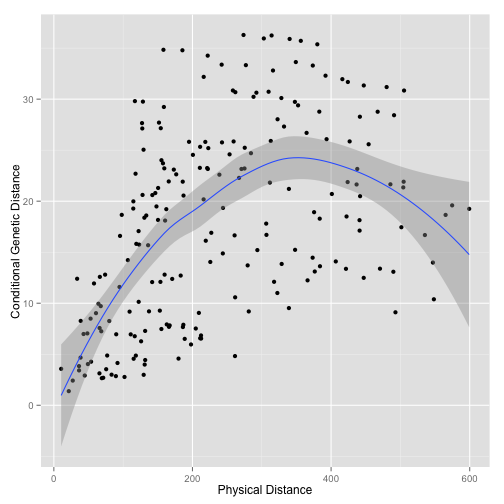


The trendline is the loess predicted line with confidence interval.  


### Node Specific Parameters

Features of the topology can be extracted as either properties of the nodes or the edges. Node properties may provide insights into localized processes (e.g., a 'sink' population).  There are a lot of different parameters that can be derived and several packages in R that help out.  Here are some basic ones.


```r
df.nodes$closeness <- closeness(lopho)
df.nodes$betweenness <- betweenness(lopho)
df.nodes$degree <- degree(lopho)
df.nodes$eigenCent <- evcent(lopho)$vector
df.nodes$Region <- factor(V(lopho)$Region)
summary(df.nodes, color = "Region")
```

```
##      Pop               Latitude      Longitude      Elevation  
##  Length:21          Min.   :23.6   Min.   :-115   Min.   :  5  
##  Class :character   1st Qu.:25.7   1st Qu.:-113   1st Qu.: 14  
##  Mode  :character   Median :28.8   Median :-112   Median : 66  
##                     Mean   :27.9   Mean   :-112   Mean   :159  
##                     3rd Qu.:29.7   3rd Qu.:-111   3rd Qu.:259  
##                     Max.   :31.9   Max.   :-110   Max.   :667  
##    closeness        betweenness       degree       eigenCent      Region
##  Min.   :0.00220   Min.   : 0.0   Min.   :3.00   Min.   :0.0006   1:12  
##  1st Qu.:0.00247   1st Qu.: 0.0   1st Qu.:4.00   1st Qu.:0.0041   2: 9  
##  Median :0.00292   Median : 4.0   Median :5.00   Median :0.1515         
##  Mean   :0.00289   Mean   :17.4   Mean   :4.95   Mean   :0.3043         
##  3rd Qu.:0.00323   3rd Qu.:25.0   3rd Qu.:6.00   3rd Qu.:0.6687         
##  Max.   :0.00384   Max.   :98.0   Max.   :7.00   Max.   :1.0000
```


The relationship betwwen the node variables can be evaluated in a pair plot.


```r
require(GGally)
ggpairs(df.nodes, columns = 2:9, color = "Region")
```

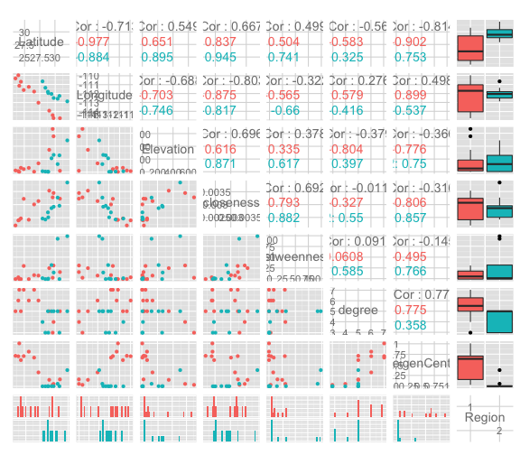


### Edge Specific Parameters


Edges may have specific properties as well.  Here are some examples using betweeness centrality, community, and regionality (if the edge connects within Baja or Sonora or crosses the Sea of Cortéz).


```r
df.edge$betweenness <- edge.betweenness(lopho)
df.edge$Region <- rep("Baja", 52)
df.edge$Region[36:52] <- "Sonora"
df.edge$Region[c(11, 24, 27, 35)] <- "Cortez"
ggpairs(df.edge, color = "Region")
```

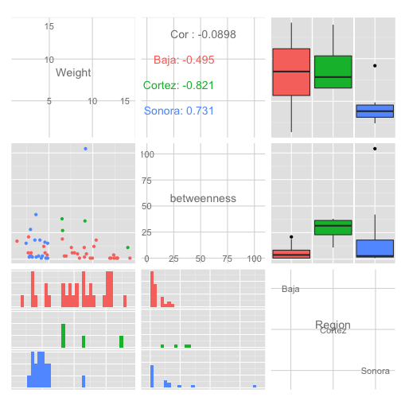


Testing for Topological Congruence
----------------------------------

If you have more than one topology and the node sets overlap sufficiently, you can test for the topological congruence of the two.  There are several specific reasons why population graph topologies may be congruent.  In this section we use the spatial genetic structure of the Senita cactus (*Lophocereus schottii*) and its obligate pollinator, *Upiga virescens* as an example.  This is an obligate pollination mutualism and as such we should expect there to be some degree of spatial genetic congruence between the species due to this co-evolution.  


```r
data(upiga)
upiga <- decorate_graph(upiga, baja, meta.stratum = "Population")
upiga.nodes <- to_SpatialPoints(upiga)
upiga.edges <- to_SpatialLines(upiga)
```


These two data sets were 'mostly' collected in the same physical locations.  Here is a comparison of the two topologies.


```r
par(mfrow = c(1, 2))
plot(lopho)
plot(upiga)
```


You can clearly see some differences in both the node and edge sets.  However, given the relationship between these organisms, there is an expectation that they should share some spatial structure.  The function `congruence_topology()` is designed to extract the congruence graph that is the intersection of both node and edge sets.  If the node sets are not completely overlapping (in this case they are not), it will give you a warning.  If you want to compare topologies, you must start with identical node sets because the topology in a Population Graph is based upon the entire structure, not just pairwise differences.  See the writeup about the **gstudio** package for more information on this.  


```r
cong <- congruence_topology(lopho, upiga)
```

```
## Warning: These two topologies have non-overlapping node sets!  Careful on
## interpretation.
```

```r
plot(cong)
```

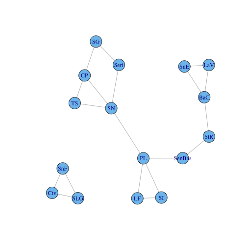


We can then take the congruence graph and plot it or work with it in the normal fashion.


```r
cong <- decorate_graph(cong, baja)
cong.nodes <- to_SpatialPoints(cong)
cong.edges <- to_SpatialLines(cong)
plot(alt)
plot(cong.edges, add = T)
plot(cong.nodes, add = T, pch = 16, col = "red")
```

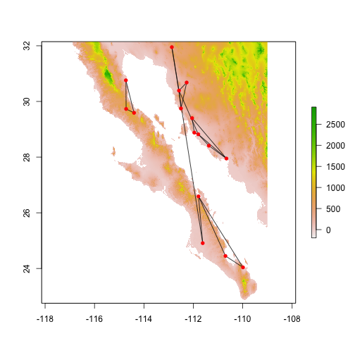


There are several ways to examine 'congruence' in graph topologies, of which I show two.  The first method is based upon the correlation of pair-wise distance through the graph for each.  That is to say, are proximate nodes in `lopho` similarily close in `upiga`?   This is called "Distance Congruence" and is based upon a non-parametric correlation of path distances.


```r
test_congruence(lopho, upiga, method = "distance")
```

```
## 
## 	Pearson's product-moment correlation
## 
## data:  distances.graph1 and distances.graph2
## t = 7.303, df = 118, p-value = 3.6e-11
## alternative hypothesis: true correlation is not equal to 0
## 95 percent confidence interval:
##  0.4207 0.6701
## sample estimates:
##    cor 
## 0.5579
```


Another way is to ask about the pattern of connectivity. Based upon the number of nodes and edges in `lopho` and `upiga`, are there more in the congruence graph than could be expected if the two graph were just randomly associated?  This is called "Structural Congruence" and is determined combinatorially.  What is returned by this is the probability having as many edges as observed in the congruence graph given the size of the edge sets in the predictor graphs. You can think of this as the fraction of the area under the line as large or larger than the observed.


```r
test_congruence(lopho, upiga, method = "combinatorial")
```

```
##     CDF 
## 0.03625
```


Hope this provides enough of an overview of the **popgraph** package to get you started.  If you have any questions feel free to email [mailto://rjdyer@vcu.edu].


References
----------

Bivand RS, Pebesma EJ, Gómez-Rubio V.  2008.  *Applied Spatial Data Analysis with R*  Springer, New York.

Dyer RJ, Nason JD. 2004. Population Graphs: the graph theoretic shape of genetic structure. *Molecular Ecology*, **13** 1713-1727.

Dyer RJ, Nason JD, Garrick RC. 2010. Landscape modeling of gene flow: improved power using conditional genetic distance derived from the topology of population networks. *Molecular Ecology*, **19**, 3746-3759.
